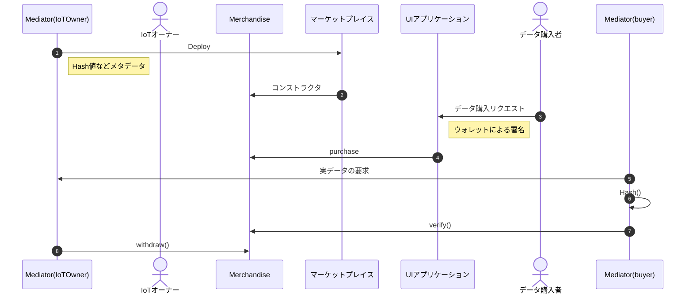
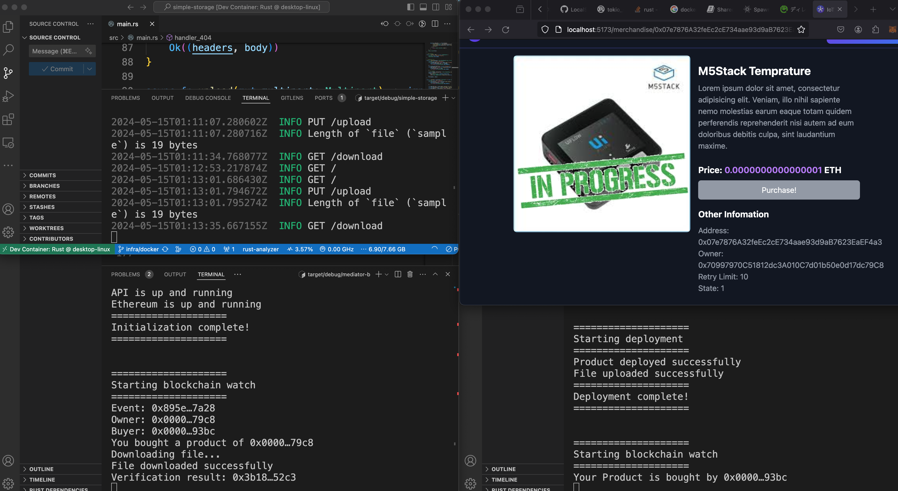

# Blockchain IoT Marketplace


## 概要
データ流通を支援する分散型需給マッチングシステム
のPoC。ブロックチェーンを用いたIoT機器のデータ流通を追体験できる。

データ流通までのワークフロー


## requirements
- Docker
- VSCode (Extensions：Docker+DevContainers)

## セットアップ
### 1. リポジトリをクローン
```
git clone --recursive https://github.com/ertlnagoya/Blockchain_IoT_Marketplace.git
```

### 2. hardhat(ブロックチェーンの)セットアップ
```
$ cd iot-market
$ code .
```
VSCodeを開いたら、`> DevContainer: Rebuild and Reopen in Container`を選択してコンテナに入る。

続いて、以下のコマンドを実行
```
$ npx hardhat node
```
これによって、ローカルネットワークが起動します。

別のターミナルを開いて、以下のコマンドを実行
```
$ npx hardhat run scripts/deployMerchandiseWithIoTMarket.ts --network localhost
```
これによってローカルネットワークに、IoT Marketといくつかのサンプルデータがデプロイされます。

### 3. Metamaskのセットアップ
ブラウザの拡張機能であるMetamaskをインストールしてください。
以下のサイトを参考にローカルネットワークのアカウント0~3をMetamaskに追加してください

参考：[Ethereumのローカルノードを立ち上げて、MetaMaskも使ってみる (hardhat) #Ubuntu - Qiita](https://qiita.com/middle_aged_rookie_programmer/items/26c3d6667c7d6514c1de)


### 4. フロントエンドのセットアップ
```
$ cd iot-market-ui
$ code .
```
VSCodeを開いたら、`> DevContainer: Rebuild and Reopen in Container`を選択してコンテナに入る。

続いて、以下のコマンドを実行
```
$ npm run dev
```
`localhost:5173`にアクセスすると、フロントエンドが表示されます。

### 5. ストレージサーバーのセットアップ
```
$ cd simple-storage
$ code .
```
VSCodeを開いたら、`> DevContainer: Rebuild and Reopen in Container`を選択してコンテナに入る。

続いて、以下のコマンドを実行
```
$ cargo run
```
これによって、ストレージサーバーが起動します。ストレージサーバーはポート3000番で待ち受けます。

### 6. Mediator(owner)のセットアップ
```
$ cd mediator-owner
$ code .
```
VSCodeを開いたら、`> DevContainer: Rebuild and Reopen in Container`を選択してコンテナに入る。

続いて、以下のコマンドを実行
```
$ cargo run
```
これによって、Mediatorが起動します。
ownerは商品のデプロイとストレージサーバーへのファイルのアップロードを行います。

### 7. Mediator(buyer)のセットアップ
```
$ cd mediator-buyer
$ code .
```
以降、手順6と同様にMediator(buyer)をセットアップしてください。

### 8. 購入手続きを行う
`localhost:5173`にアクセスし、metamaskでアカウントをbuyerのものに切り替えてください。その後、mediator(owner)の実行によってデプロイされた商品を購入してください。正しくセットアップされていれば、buyerはイベントをキャッチしてストレージサーバーからファイルをダウンロードするはずです。

