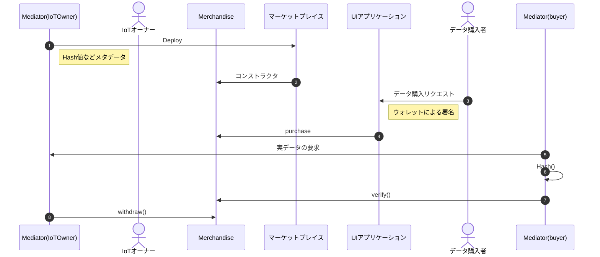
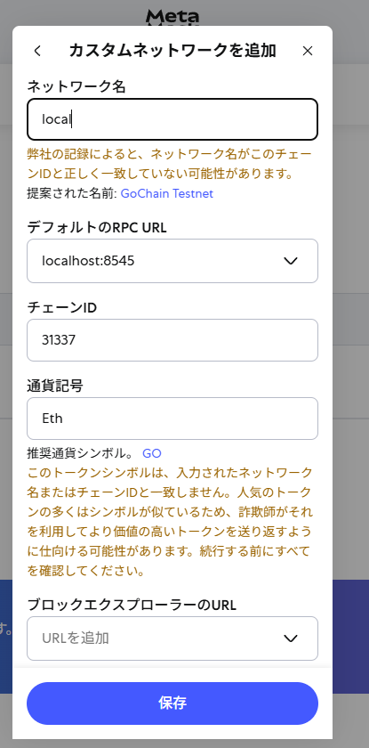
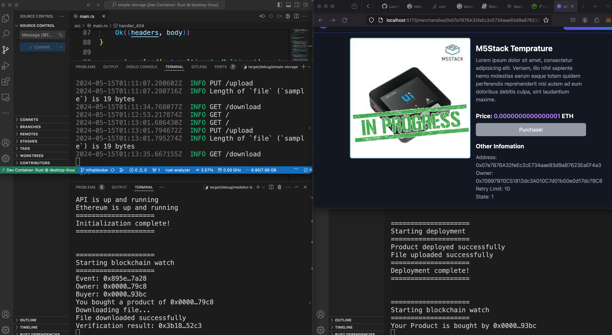

# Blockchain IoT Marketplace


## 概要

データ流通を支援する分散型需給マッチングシステム
のPoC。ブロックチェーンを用いたIoT機器のデータ流通を追体験できる。

データ流通までのワークフロー


```mermaid
sequenceDiagram
    autonumber
    participant Mediator(IoTOwner)
    actor iotOwner as IoTオーナー
    participant Merchandise
    participant IoTMarketplace as マーケットプレイス
    participant Frontend as UIアプリケーション
    actor buyer as データ購入者
    participant Mediator(buyer)
    Mediator(IoTOwner)->>IoTMarketplace: Deploy
    Note right of Mediator(IoTOwner): Hash値などメタデータ
    IoTMarketplace->>Merchandise: コンストラクタ
    buyer->>Frontend: データ購入リクエスト
    Note left of buyer: ウォレットによる署名
    Frontend->>Merchandise: purchase
    Mediator(buyer)->>Mediator(IoTOwner): 実データの要求
    Mediator(buyer)->>Mediator(buyer):Hash()
    Mediator(buyer)->>Merchandise: verify()
    Mediator(IoTOwner)->>Merchandise: withdraw()
```

## requirements

- Docker
- VSCode (Extensions：Docker+DevContainers)

## セットアップ

### 1. リポジトリをクローン

```bash
git clone --recursive https://github.com/ertlnagoya/Blockchain_IoT_Marketplace.git
```

### 2. hardhat(ブロックチェーンの)セットアップ

```bash
cd iot-market
code .
```

VSCodeを開いたら、`> DevContainer: Rebuild and Reopen in Container`を選択してコンテナに入る。

続いて、以下のコマンドを実行

```bash
npx hardhat node
```

これによって、ローカルネットワークが起動します。

別のターミナルを開いて、以下のコマンドを実行

```bash
npx hardhat run scripts/deployMerchandiseWithIoTMarket.ts --network localhost
```

これによってローカルネットワークに、IoT Marketといくつかのサンプルデータがデプロイされます。
（注意）コントラクトのデプロイは不安定で、コントラクト名が`UnrecognizedContract`になる失敗がある（DevContainer作成直後は失敗する印象）。  
デプロイしたコントラクト名が正常に表示されていない場合、`npx hardhat node`からやり直す。

### 3. Metamaskのセットアップ

ブラウザの拡張機能である[MetaMask](https://chromewebstore.google.com/detail/metamask/nkbihfbeogaeaoehlefnkodbefgpgknn?hl=ja&utm_source=ext_sidebar)をインストールしてください。  
次にMetaMaskの新規ウォレットを作成してください（パスワードは簡易で覚えやすい`password`を推奨、ここで作成したウォレットは実験では使わないから。）。  
ウォレットの保護は`後で通知`でスキップしてください。  

ブロックチェーンのネットワークを追加してください。  
  

下記の4つの秘密鍵で、アカウントを追加してください。  

```txt
0xac0974bec39a17e36ba4a6b4d238ff944bacb478cbed5efcae784d7bf4f2ff80
```

```txt
0x59c6995e998f97a5a0044966f0945389dc9e86dae88c7a8412f4603b6b78690d
```

```txt
0x5de4111afa1a4b94908f83103eb1f1706367c2e68ca870fc3fb9a804cdab365a
```

```txt
0x7c852118294e51e653712a81e05800f419141751be58f605c371e15141b007a6
```

参考：[Ethereumのローカルノードを立ち上げて、MetaMaskも使ってみる (hardhat) #Ubuntu - Qiita](https://qiita.com/middle_aged_rookie_programmer/items/26c3d6667c7d6514c1de)

### 4. フロントエンドのセットアップ

```bash
cd iot-market-ui
code .
```

VSCodeを開いたら、`> DevContainer: Rebuild and Reopen in Container`を選択してコンテナに入る。

続いて、以下のコマンドを実行

```bash
npm run dev
```

`localhost:5173`にアクセスすると、フロントエンドが表示されます。

### 5. ストレージサーバーのセットアップ

```bash
cd simple-storage
code .
```

VSCodeを開いたら、`> DevContainer: Rebuild and Reopen in Container`を選択してコンテナに入る。

続いて、以下のコマンドを実行

```bash
cargo run
```

これによって、ストレージサーバーが起動します。ストレージサーバーはポート3000番で待ち受けます。

### 6. Mediator(owner)のセットアップ

```bash
cd mediator-owner
code .
```

VSCodeを開いたら、`> DevContainer: Rebuild and Reopen in Container`を選択してコンテナに入る。
`mediator-owner/.devcontainer/devcontainer.json`の`postCreateCommand`により、Pythonスクリプトの実行に必要なライブラリが自動的にインストールされる。  

続いて、以下のコマンドを実行

```bash
cargo run
```

これによって、Mediatorが起動します。
ownerは商品のデプロイとストレージサーバーへのファイルのアップロードを行います。

### 7. Mediator(buyer)のセットアップ

```bash
cd mediator-buyer
code .
```

以降、手順6と同様にMediator(buyer)をセットアップしてください。

### 8. 購入手続きを行う

Mediator(owner)で`raw_data`にmp4ファイルを出し入れして、mediatorに新しい動画が来たと認識させてください。  
（注意）ファイル更新のnotifyはDocker上では不安定であるため、ファイル更新のイベントが検出されない場合はMediator(owner)で`cargo run`し直してください（最初の数回は失敗する印象）。イベントが検出されたら、`cargo run`中で`watcher's event.kind: ...`と標準出力します（成功）。
`localhost:5173`にアクセスし、metamaskでアカウントをbuyerのもの（UUIDが`0x3c`で始まるもの）に切り替えてください。  
その後、mediator(owner)の実行によってデプロイされた商品を購入してください。  
正しくセットアップされていれば、buyerはイベントをキャッチしてストレージサーバーから`downloads/`にファイルをダウンロードするはずです。



## Tips

- システムを再起動すると、ローカルネットワークのブロックとMetaMaskが持つブロックがずれ、コントラクトの実行に失敗する。
  - 解決するときの手順
    1. MetaMaskの設定->高度な設定->アクティビティタブのデータを消去
    2. ブラウザを閉じる
    3. DevContainerを再起動し、各種コンポーネントを起動
    4. ブラウザでMetaMaskを開き、ログイン
    5. それぞれのアカウントのデポジットは回復しているはず
