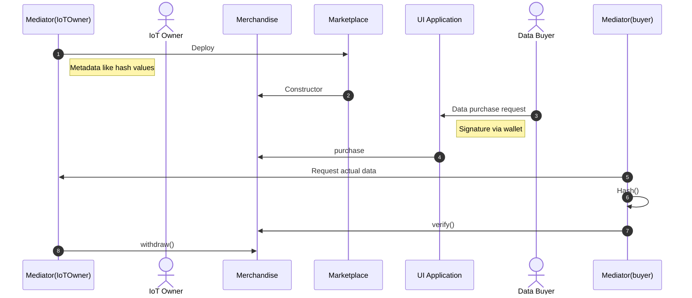

# Blockchain IoT Marketplace


<table>
	<thead>
    	<tr>
      		<th style="text-align:center">English</th>
      		<th style="text-align:center"><a href="README_ja.md">日本語</a></th>
    	</tr>
  	</thead>
</table>

## Overview

Proof of Concept (PoC) for a decentralized demand-supply matching system that supports data distribution.  
You can simulate the flow of IoT device data using blockchain technology.

### Workflow for Data Distribution


```mermaid
sequenceDiagram
    autonumber
    participant Mediator(IoTOwner)
    actor iotOwner as IoT Owner
    participant Merchandise
    participant IoTMarketplace as Marketplace
    participant Frontend as UI Application
    actor buyer as Data Buyer
    participant Mediator(buyer)
    Mediator(IoTOwner)->>IoTMarketplace: Deploy
    Note right of Mediator(IoTOwner): Metadata like hash values
    IoTMarketplace->>Merchandise: Constructor
    buyer->>Frontend: Data purchase request
    Note left of buyer: Signature via wallet
    Frontend->>Merchandise: purchase
    Mediator(buyer)->>Mediator(IoTOwner): Request actual data
    Mediator(buyer)->>Mediator(buyer): Hash()
    Mediator(buyer)->>Merchandise: verify()
    Mediator(IoTOwner)->>Merchandise: withdraw()
```

## Requirements

- Docker  
- VSCode (Extensions: Docker + DevContainers)

## Setup

### 1. Clone the Repository

```bash
git clone --recursive https://github.com/ertlnagoya/Blockchain_IoT_Marketplace.git
```

### 2. Setup hardhat (blockchain tool)

```bash
cd iot-market
code .
```

After opening in VSCode, select `> DevContainer: Rebuild and Reopen in Container` to enter the container.

Then execute the following command:

```bash
npx hardhat node
```

This will start the local blockchain network.

Open another terminal and run:

```bash
npx hardhat run scripts/deployMerchandiseWithIoTMarket.ts --network localhost
```

This will deploy the IoT Market and several sample data sets on the local network.  
**Note:** Deployment can be unstable, and the contract name may appear as `UnrecognizedContract`. (This often happens right after creating the DevContainer.)  
If the deployed contract name does not appear correctly, restart from `npx hardhat node`.

### 3. Setup Metamask

Install [MetaMask](https://chromewebstore.google.com/detail/metamask/nkbihfbeogaeaoehlefnkodbefgpgknn?hl=ja&utm_source=ext_sidebar) as a browser extension.  
Then, create a new MetaMask wallet (for testing purposes, we recommend using a simple password like `password`).  
Skip wallet backup protection by selecting “Remind me later.”

Add the blockchain network:  


Add accounts using the following four private keys:

```txt
0xac0974bec39a17e36ba4a6b4d238ff944bacb478cbed5efcae784d7bf4f2ff80
```

```txt
0x59c6995e998f97a5a0044966f0945389dc9e86dae88c7a8412f4603b6b78690d
```

```txt
0x5de4111afa1a4b94908f83103eb1f1706367c2e68ca870fc3fb9a804cdab365a
```

```txt
0x7c852118294e51e653712a81e05800f419141751be58f605c371e15141b007a6
```

Reference: [Running a local Ethereum node with MetaMask (hardhat) #Ubuntu - Qiita](https://qiita.com/middle_aged_rookie_programmer/items/26c3d6667c7d6514c1de)

### 4. Setup Frontend

```bash
cd iot-market-ui
code .
```

Open in VSCode and select `> DevContainer: Rebuild and Reopen in Container`.

Then run:

```bash
npm run dev
```

Access `localhost:5173` to view the frontend.

### 5. Setup Storage Server

```bash
cd simple-storage
code .
```

Open in VSCode and select `> DevContainer: Rebuild and Reopen in Container`.

Then run:

```bash
cargo run
```

This will start the storage server. The server will listen on port 3000.

### 6. Setup Mediator (owner)

```bash
cd mediator-owner
code .
```

Open in VSCode and select `> DevContainer: Rebuild and Reopen in Container`.  
The required Python libraries will be automatically installed via the `postCreateCommand` in `mediator-owner/.devcontainer/devcontainer.json`.

Then run:

```bash
cargo run
```

This will start the Mediator process.  
The owner is responsible for deploying merchandise and uploading files to the storage server.

### 7. Setup Mediator (buyer)

```bash
cd mediator-buyer
code .
```

Follow the same steps as in step 6 to set up the buyer mediator.

### 8. Make a Purchase

Place an mp4 file into `raw_data` in the Mediator(owner) directory to trigger recognition of a new video.  
**Note:** File event notifications are unstable on Docker. If events are not detected, restart `cargo run` in Mediator(owner). You should see log output like `watcher's event.kind: ...` when successful.

Access `localhost:5173` and switch the MetaMask account to the one starting with UUID `0x3c`.  
Then, purchase the product deployed by the Mediator(owner).  
If everything is set up correctly, the buyer will receive the event and download the file to `downloads/` from the storage server.


## Tips

- If you restart the system, the block state in the local network and MetaMask may become unsynchronized, causing contract execution to fail.  
  - Steps to recover:
    1. In MetaMask: Settings → Advanced → Clear activity tab data
    2. Close the browser
    3. Restart the DevContainer and all components
    4. Open MetaMask in the browser and log in
    5. Deposits in each account should recover