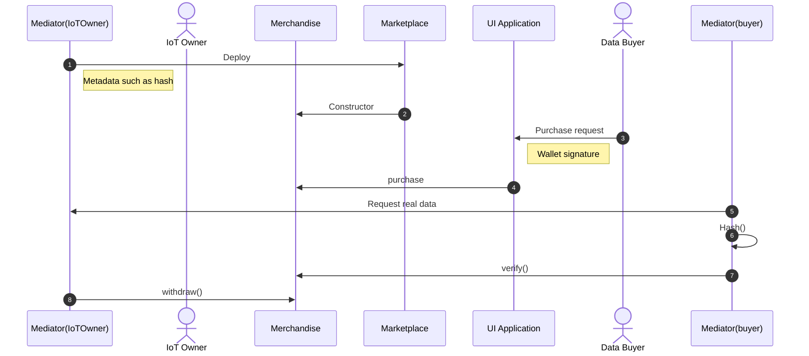
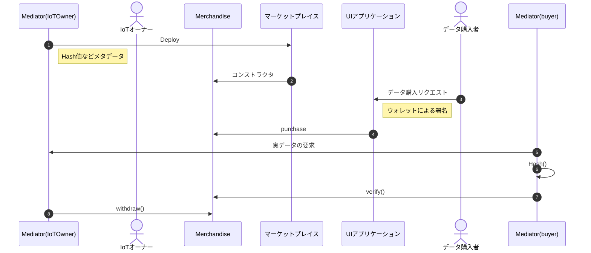

# IoT データマーケットプレイス

<p align="center">
  <a href="#english-readme">English README</a> ｜ <a href="#日本語-readme">日本語 README</a>
</p>

---
## English README

A blockchain-based framework for distributing IoT data.

### Recommended Environment

- Prefer developing with Docker Desktop (so that `host.docker.internal` works).
- If Docker Desktop is installed, comment out `runArgs` in `devcontainer.json`.

### Usage

#### Setup

- Clone the project

```bash
git clone https://github.com/ertlnagoya/iot-market.git
cd iot-market
```

- Start Dev Container  
  Install VS Code extension “Dev Containers”.  
  Open Command Palette and choose “Dev Containers: Open Folder in Container”.

- Create `.env`  
  Copy `.env.example` to `.env` and edit values.

```bash
cp .env.example .env
```

### Commands

- Compile

```bash
npx hardhat compile
```

- Generate contract type definitions (TypeChain)

```bash
npx hardhat typechain
```

- Test

```bash
npx hardhat test
```

- Run local network (Hardhat Node)

```bash
npx hardhat node
```

- Deploy  
  Use `--network` to select the target: `sepolia` (testnet), `localhost` (local), `hardhat` (ephemeral; default).  
  When targeting `sepolia`, Etherscan verification will run.  
  Use `--tags` to choose which contracts to deploy. `all` deploys everything; otherwise pass a comma-separated list (default `all`).  
  See scripts under `deploy/` for details.

```bash
npx hardhat deploy --tags {tags} --network {network}
```

### Sequence (Purchase to Verification)



---

## 日本語 README

ブロックチェーンを用いた IoT データの流通フレームワークです。

### 推奨環境

- Docker Desktop 環境での開発を推奨します（`host.docker.internal` が使用できるため）。
- Docker Desktop がインストールされている場合、`devcontainer.json` の `runArgs` をコメントアウトしてください。

### 使い方

#### セットアップ

- プロジェクトをクローンする

```bash
git clone https://github.com/ertlnagoya/iot-market.git
cd iot-market
```

- devcontainer の起動  
  VS Code の拡張機能「Remote - Containers（Dev Containers）」をインストールしてください。  
  コマンドパレットから「Dev Containers: Open Folder in Container」を選択し、コンテナ内で開きます。

- .env ファイルを作成する  
  `.env.example` をコピーして `.env` を作成・編集してください。

```bash
cp .env.example .env
```

### コマンド

- コンパイル

```bash
npx hardhat compile
```

- コントラクトの型定義ファイルの生成（TypeChain）

```bash
npx hardhat typechain
```

- テスト

```bash
npx hardhat test
```

- ローカルネットワークの起動（Hardhat Node）

```bash
npx hardhat node
```

- デプロイ  
  `--network` でデプロイ先を指定できます：`sepolia`（テストネット）, `localhost`（ローカル）, `hardhat`（一時ネットワーク。デフォルト）。  
  `sepolia` を指定した場合は Etherscan へのコード検証も実施します。  
  `--tags` でデプロイするコントラクト群を指定可能。`all` は全コントラクト、カンマ区切りで複数指定も可能（デフォルト `all`）。  
  詳細は `deploy/` 内のスクリプトを参照してください。

```bash
npx hardhat deploy --tags {tags} --network {network}
```

### シーケンス図（購入〜検証）


